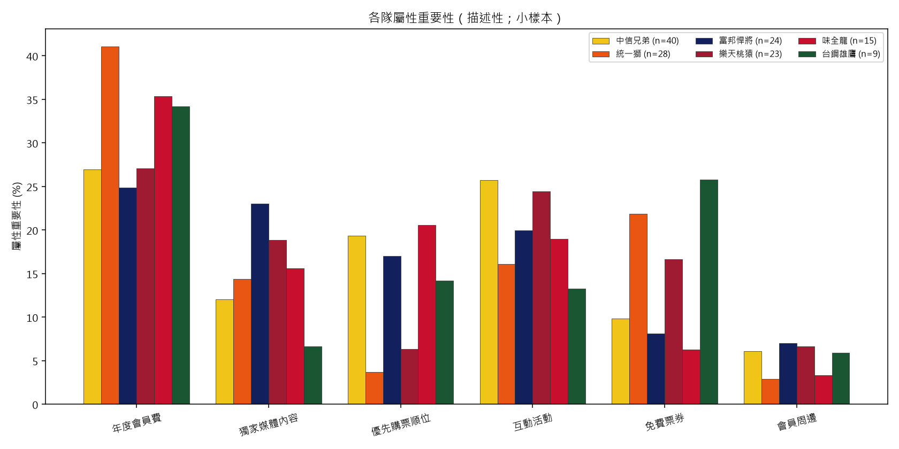
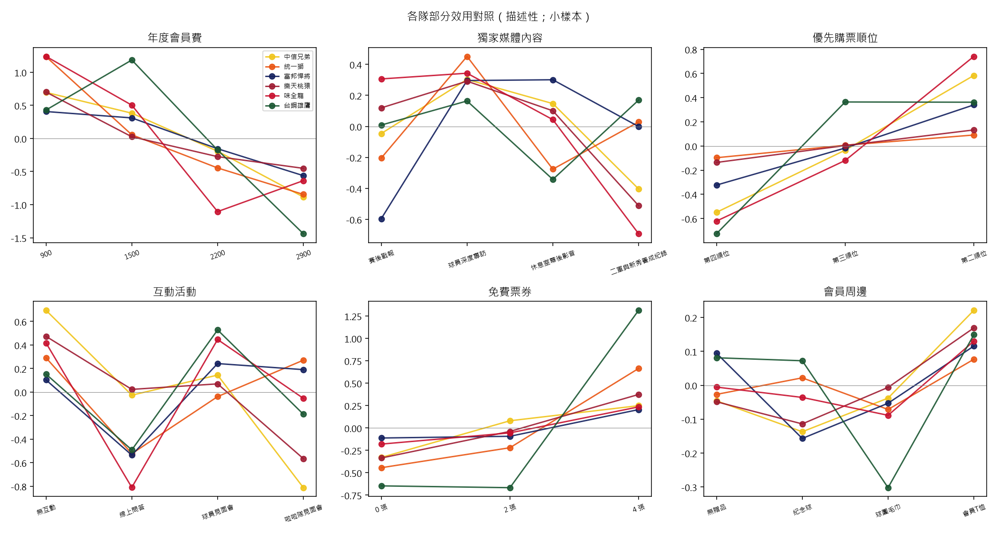

# 球隊間偏好比較（不同球隊粉絲對不同屬性的態度）

> 研究重點分析。兩條路徑：(1) 交互項模型（推論主軸）；(2) 逐隊單獨估並列（描述性對照）。
> 有效樣本 N = 139，分屬 6 隊。

## 路徑一：球隊 × 屬性 交互項模型（推論）

- 以人氣最高的 **中信兄弟**（n=40）為參考組，其餘 5 隊各與所有屬性效果編碼交互。
- 整體交互項聯合檢定（含交互 vs 不含）：**LR = 154.26, df = 80, p = 0.0000**
  → p < .05：球隊整體調節屬性偏好，至少一屬性偏好在隊間有顯著差異。

### 逐屬性交互項聯合顯著性（哪個屬性的偏好在隊間有差）
| 屬性 | LR | df | p | 隊間差異 |
|------|---:|---:|---:|:---:|
| 年度會員費 | 25.43 | 15 | 0.0445 | ✅ 顯著 |
| 獨家媒體內容 | 20.79 | 15 | 0.1437 | — |
| 優先購票順位 | 13.33 | 10 | 0.2058 | — |
| 互動活動 | 57.94 | 15 | 0.0000 | ✅ 顯著 |
| 免費票券 | 45.20 | 10 | 0.0000 | ✅ 顯著 |
| 會員周邊 | 30.39 | 15 | 0.0106 | ✅ 顯著 |

- 隊間偏好有顯著差異的屬性：**年度會員費、互動活動、免費票券、會員周邊**。

> ⚠️ **小樣本警示**：N=74 拆 6 隊後每隊 5–19 人，交互項考驗力低，未達顯著不代表偏好真的相同，可能是樣本不足以偵測。建議補樣本後複查。

## 路徑二：逐隊單獨估 part-worth（描述性對照）

> ⚠️ **此節為描述性**：各隊單獨估計 16 個效果編碼參數，N 偏小（尤其台鋼 N=5）使 SE 極大，隊間差異多數無法做統計推論，僅供型態觀察。

### 各隊屬性重要性 (%)
| 屬性 | 中信兄弟(n=40) | 統一獅(n=28) | 富邦悍將(n=24) | 樂天桃猿(n=23) | 味全龍(n=15) | 台鋼雄鷹(n=9) |
|------|---|---|---|---|---|---|
| 年度會員費 | 27.0 | 41.1 | 24.9 | 27.1 | 35.3 | 34.2 |
| 獨家媒體內容 | 12.1 | 14.4 | 23.0 | 18.9 | 15.6 | 6.7 |
| 優先購票順位 | 19.3 | 3.7 | 17.0 | 6.3 | 20.5 | 14.2 |
| 互動活動 | 25.7 | 16.1 | 20.0 | 24.4 | 18.9 | 13.3 |
| 免費票券 | 9.9 | 21.9 | 8.1 | 16.7 | 6.3 | 25.8 |
| 會員周邊 | 6.1 | 2.9 | 7.0 | 6.7 | 3.3 | 5.9 |

### 各隊最重視屬性（importance argmax）
- **中信兄弟**（n=40）：年度會員費（27.0%）
- **統一獅**（n=28）：年度會員費（41.1%）
- **富邦悍將**（n=24）：年度會員費（24.9%）
- **樂天桃猿**（n=23）：年度會員費（27.1%）
- **味全龍**（n=15）：年度會員費（35.3%）
- **台鋼雄鷹**（n=9）：年度會員費（34.2%）

